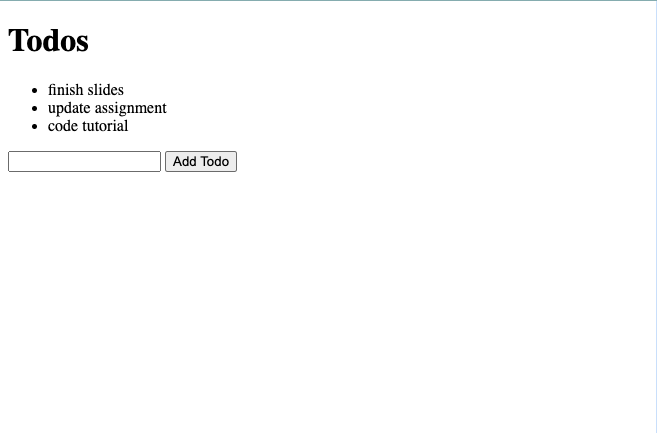

# localStorage

This app explores localStorage, and how to leverage it in a PWA.

## Getting Started

### Pre- requisites

Ensure you have Node.js installed on your system to manage packages and run the development server.

### Installation

1. Clone this repository or download the source code.
1. Navigate to the project directory, then to `02-local-storage/`
1. Run `npm install`

### Start the app

Run `npm run start` to start the application using `http-server`.

## Todos Application Features

### Todo List Functionality

Add items to your todo list, view them in a simple list format, and have them persist across browser sessions thanks to localStorage.

### PWA Setup

Includes a basic setup of a service worker for offline support and fast loading, showcasing a key aspect of Progressive Web Apps.

## Pros 👍

- Already built-in browsers, without needing extra plugins.
- Synchronous! Executes data operations in order, ensuring immediate and predictable access
- Speed! Quick data retrieval and storage, ideal for small-scale data management.

## Cons 👎

- Synchronous calls in ;localStorage can cause blocking, potentially slowing down your app.
- Not suitable for large chunks of data, only for tiny values, such as IDs.
- Not accessible is in a service worker 😕 limiting its utility in certain PWA features.

## Data Handling in localStorage

- Each value in localStorage is stored as a string. Non-string values are automatically converted (stringified) when stored.
- In our app, todo items are stored as an array of strings,
