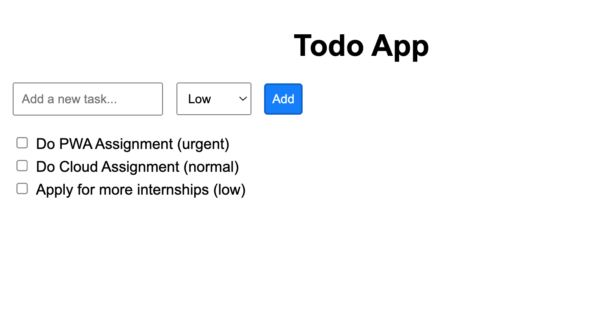

# localStorage

This Todo app is a PWA that utilizes localStorage.

## Getting Started

### Pre- requisites

Ensure you have Node.js installed on your system to manage packages and run the development server.

### Installation

1. Clone this repository or download the source code.
1. Navigate to the Assignment directory 
1. Run `npm install`

### Start the app

Run `npm run start` to start the application using `http-server`.

## Todos Application Features

### Todo List Functionality

Add items to your todo list with default priority normal, view them in a simple list format, delete item from todo list
and have them persist across browser sessions thanks to localStorage.

### PWA Setup

Includes a basic setup of a service worker for offline support and fast loading, showcasing a key aspect of Progressive Web Apps.

## Data Handling in localStorage

- Each value in localStorage is stored as a string. Non-string values are automatically converted (stringified) when stored.
- In our app, todo items are stored as an array of strings
